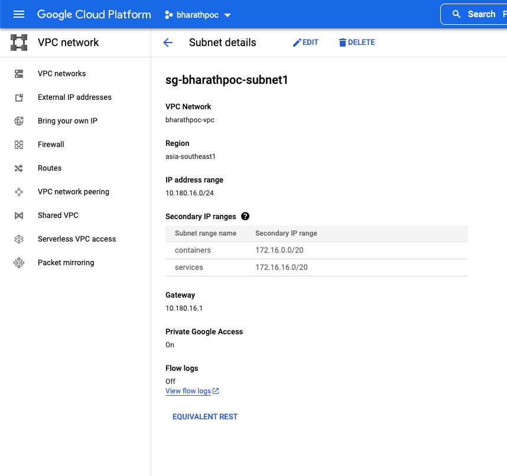

# gcp_containernative_loadbalancing
Container Native Loadbalancing


### Project: bharathpoc


| Name                  | IP Range                       | Region/GKE     |   VPC                      | Private GKE Master IP range                     |
| --------------------- | ------------------------------ | -------------- | -------------------------- | ----------------------------------------------- |
| google-managed-services-allocated-range| 10.180.0.0/20 | asia-southeast1|   bharathpoc-vpc    |                                                 |
| sg-bharathpoc-subnet1 | 10.180.16.0/24 | asia-southeast1|   bharathpoc-vpc    |                                                                 |    
| sg-bharathpoc-subnet1 | 172.16.0.0/20(GKE Containers & 172.16.16.0/20(GKE Services) | asia-southeast1|   bharathpoc-vpc  | 192.168.0.0/28       |
| sg-bharathpoc-subnet2 | 10.180.17.0/24  | asia-southeast1|   bharathpoc-vpc    |                                                                |
| sg-bharathpoc-subnet2 | 172.16.32.0/20(GKE Containers) & 172.16.48.0/20(GKE Services) | asia-southeast1| bharathpoc-vpc  | 192.168.0.16/28      |

* **vpc in google console**




### Create GKE CLuster

```
MacBook-Pro:gcp_containernative_loadbalancing bharathdasaraju$ gcloud beta container clusters create "bknegdemo1"  \
      --project "bharathpoc" \
      --zone "asia-southeast1-a" --no-enable-basic-auth \
      --cluster-version "1.20.12-gke.1500" --release-channel "stable" \
      --machine-type "e2-medium" --image-type "COS_CONTAINERD" \
      --disk-type "pd-standard" --disk-size "100" \
      --metadata disable-legacy-endpoints=true \
      --scopes "https://www.googleapis.com/auth/devstorage.read_only","https://www.googleapis.com/auth/logging.write","https://www.googleapis.com/auth/monitoring","https://www.googleapis.com/auth/servicecontrol","https://www.googleapis.com/auth/service.management.readonly","https://www.googleapis.com/auth/trace.append" \
      --max-pods-per-node "110" --num-nodes "2" \
      --logging=SYSTEM,WORKLOAD --monitoring=SYSTEM \
      --enable-private-nodes --master-ipv4-cidr "192.168.0.0/28" \
      --enable-master-global-access \
      --enable-ip-alias \
      --network "projects/bharathpoc/global/networks/bharathpoc-vpc" \
      --subnetwork "projects/bharathpoc/regions/asia-southeast1/subnetworks/sg-bharathpoc-subnet1" \
      --cluster-secondary-range-name "containers" --services-secondary-range-name "services" \
      --no-enable-intra-node-visibility --default-max-pods-per-node "110" \
      --enable-autoscaling --min-nodes "2" --max-nodes "3" \
      --enable-master-authorized-networks --master-authorized-networks 220.255.107.222/32 \
      --addons HorizontalPodAutoscaling,HttpLoadBalancing,NodeLocalDNS,GcePersistentDiskCsiDriver \
      --enable-autoupgrade --enable-autorepair \
      --max-surge-upgrade 1 --max-unavailable-upgrade 0 \
      --maintenance-window-start "2022-03-03T14:00:00Z" --maintenance-window-end "2022-03-04T13:00:00Z" --maintenance-window-recurrence "FREQ=WEEKLY;BYDAY=SU" \
      --enable-vertical-pod-autoscaling --enable-shielded-nodes --enable-l4-ilb-subsetting \
      --node-locations "asia-southeast1-a","asia-southeast1-b","asia-southeast1-c"
Note: The Pod address range limits the maximum size of the cluster. Please refer to https://cloud.google.com/kubernetes-engine/docs/how-to/flexible-pod-cidr to learn how to optimize IP address allocation.
Note: Once enabled, L4 ILB Subsetting cannot be disabled.
Creating cluster bknegdemo1 in asia-southeast1-a... Cluster is being health-checked (master is healthy)...done.
Created [https://container.googleapis.com/v1beta1/projects/bharathpoc/zones/asia-southeast1-a/clusters/bknegdemo1].
To inspect the contents of your cluster, go to: https://console.cloud.google.com/kubernetes/workload_/gcloud/asia-southeast1-a/bknegdemo1?project=bharathpoc
kubeconfig entry generated for bknegdemo1.
NAME        LOCATION           MASTER_VERSION    MASTER_IP      MACHINE_TYPE  NODE_VERSION      NUM_NODES  STATUS
bknegdemo1  asia-southeast1-a  1.20.12-gke.1500  35.247.139.96  e2-medium     1.20.12-gke.1500  6          RUNNING
MacBook-Pro:gcp_containernative_loadbalancing bharathdasaraju$
```
* **with alias IP addresses enabled, GKE clusters can allocate IP addresses from a CIDR block that is known to the Google Cloud platform.**
* **That makes our cluster more scalable and allows our cluster to better interact with other GCP products and services**


### Connect k8s cluster

```
MacBook-Pro:gcp_containernative_loadbalancing bharathdasaraju$ gcloud container clusters get-credentials bknegdemo1 --zone asia-southeast1-a --project bharathpoc
Fetching cluster endpoint and auth data.
kubeconfig entry generated for bknegdemo1.
MacBook-Pro:gcp_containernative_loadbalancing bharathdasaraju$ kubectl get nodes -o wide
NAME                                        STATUS   ROLES    AGE     VERSION             INTERNAL-IP    EXTERNAL-IP   OS-IMAGE                             KERNEL-VERSION   CONTAINER-RUNTIME
gke-bknegdemo1-default-pool-844fde2f-6tzq   Ready    <none>   8m44s   v1.20.12-gke.1500   10.180.16.8    <none>        Container-Optimized OS from Google   5.4.144+         containerd://1.4.8
gke-bknegdemo1-default-pool-844fde2f-plsw   Ready    <none>   8m43s   v1.20.12-gke.1500   10.180.16.9    <none>        Container-Optimized OS from Google   5.4.144+         containerd://1.4.8
gke-bknegdemo1-default-pool-a84f312f-6cdd   Ready    <none>   8m49s   v1.20.12-gke.1500   10.180.16.12   <none>        Container-Optimized OS from Google   5.4.144+         containerd://1.4.8
gke-bknegdemo1-default-pool-a84f312f-f0w5   Ready    <none>   8m50s   v1.20.12-gke.1500   10.180.16.13   <none>        Container-Optimized OS from Google   5.4.144+         containerd://1.4.8
gke-bknegdemo1-default-pool-ed58839b-41h1   Ready    <none>   8m55s   v1.20.12-gke.1500   10.180.16.10   <none>        Container-Optimized OS from Google   5.4.144+         containerd://1.4.8
gke-bknegdemo1-default-pool-ed58839b-tpx6   Ready    <none>   8m42s   v1.20.12-gke.1500   10.180.16.11   <none>        Container-Optimized OS from Google   5.4.144+         containerd://1.4.8
MacBook-Pro:gcp_containernative_loadbalancing bharathdasaraju$
```
